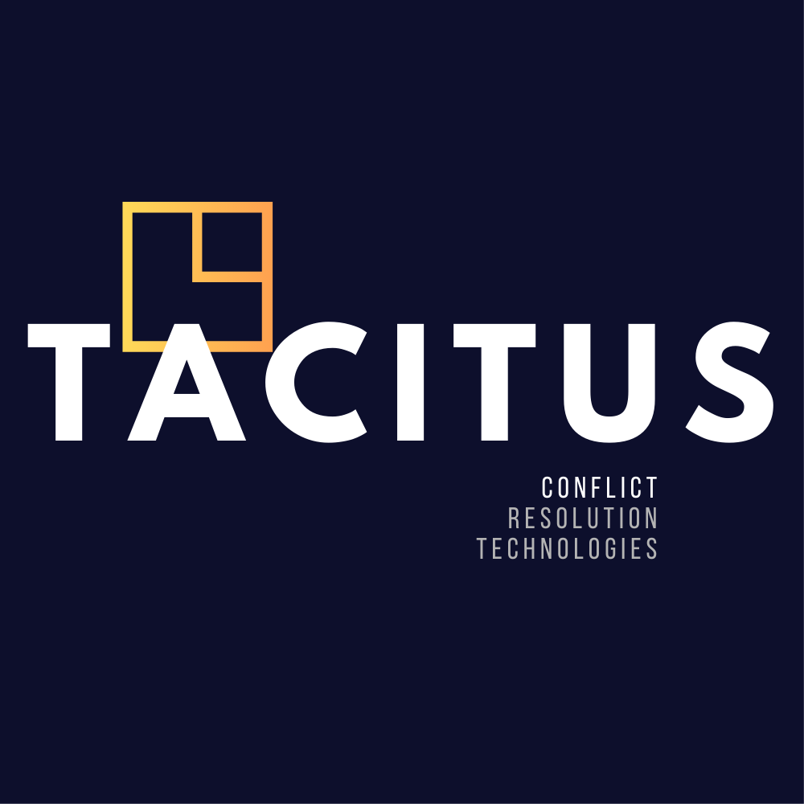
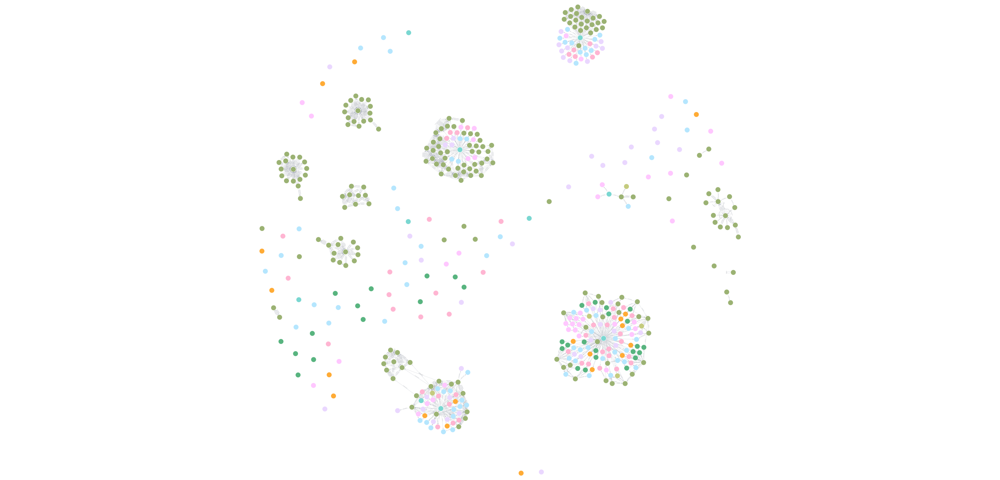

<p align="center">
  
</p>

<h1 align="center">TACITUS Knowledge Pipeline</h1>

<p align="center">
  <strong>Deterministic AI Reasoning over Knowledge Graphs for Conflict Intelligence</strong>
</p>

<pre align="center">
  _______    ___       ______  _______  _______  __   __  _______
 |       |  |   |     |      ||       ||       ||  | |  ||       |
 |_     _|  |   |     |  _    ||    ___||_     _||  | |  ||  _____|
   |   |    |   |     | | |   ||   |___   |   |  |  |_|  || |_____
   |   |    |   |___  | |_|   ||    ___|  |   |  |       ||_____  |
   |   |    |       | |       ||   |___   |   |  |       | _____| |
   |___|    |_______| |______||_______|  |___|  |_______||_______|
</pre>

<p align="center">
  <a href="https://tacitus.me">Website</a> &middot;
  <a href="#quickstart">Quickstart</a> &middot;
  <a href="#architecture">Architecture</a> &middot;
  <a href="#why-deterministic">Why Deterministic?</a> &middot;
  <a href="#cypher-queries">Query Examples</a>
</p>

<p align="center">
  
  
  
  
  <a href="https://colab.research.google.com/github/sargonxg/TACITUS-Knowledge-Pipeline-open/blob/main/TACITUS_PIPELINE_Workbench_v8.ipynb"></a>
</p>

---

> **TACITUS** turns messy, unstructured text — emails, transcripts, reports — into a
> **time-aware, evidence-linked knowledge graph** that you can query, audit, and reason over.
> No hallucinations. No black boxes. Every claim traces back to a source span.

## Grounded Conflict Reasoning (Simplified, Publishable Reference)

This repository is a **clean, simplified reference pipeline** that shows what it takes to ground AI reasoning in evidence for conflict and human-friction analysis. It mirrors the structure we use at TACITUS, but in a compact, publishable form designed for experimentation, customization, and learning — not as the full production stack.

What you can explore here:
- **Ontology customization**: adjust the conflict primitives, roles, and relationships that define your domain.
- **Deterministic reasoning**: see how contradictions, influence, and issue clusters are derived without stochastic LLM judgment.
- **Evidence grounding**: every claim links back to a precise source span for auditability.

If you want to test what *grounded AI conflict reasoning* really means — and how to make it reproducible — this repo is the place to start.

<p align="center">
  
</p>

---

## The Problem

LLMs are powerful generators. They are terrible reasoners.

Ask an LLM to analyze a conflict — a geopolitical dispute, a corporate negotiation, an intelligence report — and you get **plausible narration**. It sounds right. It reads well. But you can't verify it. You can't trace *why* the model believes Actor X opposes Actor Y. You can't audit the chain from raw evidence to conclusion. And when two claims contradict each other, the LLM doesn't flag it — it just picks whichever sounds more fluent.

This is the fundamental gap: **generation without grounding is not analysis**.

## The TACITUS Approach

TACITUS doesn't ask the LLM to reason. It asks the LLM to **extract** — structured entities, relationships, claims, and evidence — then performs reasoning **deterministically** over a knowledge graph.

```
Unstructured Text ──► LLM Extraction ──► Knowledge Graph ──► Deterministic Reasoning
     (messy)           (structured)        (auditable)          (verifiable)
```

The LLM is a powerful extraction engine. The graph is the reasoning substrate. The logic is yours to inspect.

---

## Why Deterministic?

<a name="why-deterministic"></a>

**Deterministic reasoning** means the same inputs always produce the same outputs through transparent, reproducible logic — no stochastic sampling, no temperature-driven variation, no hidden weights making the decision.

| Approach | How it "reasons" | Auditable? | Reproducible? |
|---|---|---|---|
| Raw LLM | Token probability sampling | No | No |
| RAG (retrieval) | Retrieved context + LLM generation | Partially | No |
| **TACITUS (graph)** | **Structured extraction + graph algorithms** | **Yes** | **Yes** |

In TACITUS:
- **Contradiction detection** uses cosine similarity + negation analysis — not LLM judgment
- **Influence scoring** uses PageRank over actor-relationship networks — not LLM opinion
- **Issue clustering** uses hierarchical agglomerative clustering on claim embeddings — not LLM summarization
- **Entity resolution** uses fuzzy string matching with configurable thresholds — not LLM guessing

Every edge in the graph, every score, every cluster assignment is **traceable, reproducible, and falsifiable**.

This matters when the stakes are real: geopolitical analysis, legal disputes, intelligence assessments, conflict mediation. You need to know *why* the system concluded what it concluded — and you need to be able to challenge it.

---

## Architecture

<a name="architecture"></a>

TACITUS operates on a **four-layer graph architecture**:

```
┌─────────────────────────────────────────────────────────────────────┐
│                        TACITUS PIPELINE                             │
│                                                                     │
│  ┌──────────┐    ┌──────────┐    ┌──────────┐    ┌──────────────┐  │
│  │  INGEST  │───►│ EXTRACT  │───►│  RESOLVE │───►│   PERSIST    │  │
│  │          │    │          │    │          │    │              │  │
│  │ Clean    │    │ Async    │    │ Fuzzy    │    │ Neo4j /      │  │
│  │ Chunk    │    │ LLM      │    │ Entity   │    │ FalkorDB     │  │
│  │ Hash     │    │ Calls    │    │ Matching │    │ + Embeddings │  │
│  └──────────┘    └──────────┘    └──────────┘    └──────────────┘  │
│                                                         │           │
│                                                         ▼           │
│                                              ┌──────────────────┐  │
│                                              │     REASON       │  │
│                                              │                  │  │
│                                              │ Contradictions   │  │
│                                              │ Influence Scores │  │
│                                              │ Issue Clusters   │  │
│                                              │ Timeline Viz     │  │
│                                              └──────────────────┘  │
└─────────────────────────────────────────────────────────────────────┘
```

### The Four Graph Layers

| Layer | Purpose | Example Nodes |
|-------|---------|---------------|
| **GND** (Grounding) | Conflict theory knowledge base | `Theory`, `Concept`, `CausalLink` |
| **CTX** (Context) | Case-specific extracted facts | `Actor`, `Event`, `Claim`, `Commitment` |
| **EVD** (Evidence) | Source provenance and text spans | `SourceDoc`, `Chunk`, `Span` |
| **RZN** (Reasoning) | Derived analytical insights | `Issue`, `Contradiction`, influence scores |

Every node in the CTX layer links down to EVD (evidence spans) and up to GND (theoretical grounding). This is what makes the graph **auditable end-to-end**.

---

## What Gets Extracted

The pipeline extracts a rich ontology of conflict primitives:

```
Actors ──────── Who is involved? (persons, organizations, groups)
  ├── Relationships ── How do they relate? (opposes, allies, influences, depends)
  ├── Interests ────── What do they want? (substantive, procedural, psychological)
  ├── Leverage ─────── What power do they hold? (coercive, economic, informational)
  └── Narratives ───── What story do they tell? (victim, aggressor, mediator)

Events ──────── What happened? (timestamped, with impact level)
Claims ──────── What was said? (demands, threats, accusations, promises)
Commitments ─── What was agreed? (active, broken, fulfilled)
Constraints ─── What limits action? (political, legal, economic)
```

Each extraction carries:
- **Confidence score** (0.0 – 1.0)
- **Evidence spans** (exact character offsets in source text)
- **Deterministic IDs** (SHA-256 hashed, stable across runs)

---

## Key Capabilities

### Theory-Guided Extraction (OntoRAG)

TACITUS doesn't extract blindly. It seeds the graph with established conflict theories — Relative Deprivation, Security Dilemma, Resource Curse, Elite Bargaining, and more — then uses **OntoRAG** (Ontology-guided Retrieval Augmented Generation) to select the most relevant theories for each document chunk before extraction.

This means the LLM receives targeted theoretical context, not a generic prompt. The result: more precise extraction aligned to recognized analytical frameworks.

### Contradiction Detection

Claims are embedded into vector space, clustered by semantic similarity, then analyzed for **negation mismatches**. When Actor A says "we will comply" and Actor B says "they will never comply," TACITUS flags it as a `POTENTIAL_CONTRADICTION` with a similarity score — deterministically, not by asking the LLM if they conflict.

### Influence Scoring (PageRank)

Actor-to-actor relationships form a directed graph. TACITUS runs **PageRank** (the algorithm that originally powered Google Search) to compute influence centrality. The most structurally connected actors surface to the top — based on graph topology, not LLM impressions.

### Evidence Provenance

Every claim, every relationship, every event links back to a **specific text span** in the source document — with character offsets, fuzzy-match confidence scores, and source document SHA-256 hashes. Nothing in the graph exists without evidence.

### Semantic Search

All entities are embedded using Google's text-embedding-004 (768D vectors) and indexed in Neo4j for **natural language queries** across the entire knowledge graph. Ask "who holds economic leverage?" and get ranked results with relevance scores.

---

## Tech Stack

| Component | Technology | Purpose |
|-----------|-----------|---------|
| **LLM Extraction** | Google Gemini 1.5 Pro (Vertex AI) | Structured entity/relationship extraction |
| **Embeddings** | text-embedding-004 (768D) | Semantic similarity and vector search |
| **Graph Database** | Neo4j / FalkorDB | Knowledge graph storage and querying |
| **Vector Search** | FAISS + Neo4j vector indexes | Similarity search at scale |
| **Entity Resolution** | RapidFuzz | Fuzzy string matching for deduplication |
| **Graph Analysis** | NetworkX | PageRank, centrality, network metrics |
| **Clustering** | scikit-learn | Agglomerative clustering for issue detection |
| **Visualization** | PyVis + Plotly | Interactive network graphs and timelines |
| **Schema Validation** | Pydantic | Type-safe extraction models |
| **Retry Logic** | Tenacity | Production-grade error recovery |
| **Runtime** | Google Colab / Jupyter | Interactive notebook-first workflow |

---

## Quickstart

<a name="quickstart"></a>

### Option 1: Google Colab (Recommended)

<a href="https://colab.research.google.com/github/sargonxg/TACITUS-Knowledge-Pipeline-open/blob/main/TACITUS_PIPELINE_Workbench_v8.ipynb">
  
</a>

1. Click the badge above to open the Workbench notebook
2. Set your credentials in the first configuration cell:

```python
import os

# Google Cloud / Vertex AI
os.environ["GCP_PROJECT_ID"]  = "your-project-id"
os.environ["GCP_REGION"]      = "us-central1"
os.environ["GEMINI_MODEL"]    = "gemini-1.5-pro"
os.environ["EMBEDDING_MODEL"] = "text-embedding-004"

# Neo4j (free tier at neo4j.io/aura works)
os.environ["NEO4J_URI"]      = "neo4j+s://xxxxx.databases.neo4j.io"
os.environ["NEO4J_USERNAME"]  = "neo4j"
os.environ["NEO4J_PASSWORD"]  = "your-password"
```

3. Upload a `.txt` file (email, transcript, report — anything with actors and events)
4. Click **Ingest** and watch the graph build
5. Query it with Cypher or natural language search

### Option 2: Local Setup

```bash
git clone https://github.com/sargonxg/TACITUS-Knowledge-Pipeline-open.git
cd TACITUS-Knowledge-Pipeline-open

pip install -r requirements.txt

# Copy and fill in your credentials
cp .env.example .env

# Open the workbench
jupyter notebook TACITUS_PIPELINE_Workbench_v8.ipynb
```

---

## Cypher Query Examples

<a name="cypher-queries"></a>

Once your graph is populated, explore it with Cypher. These queries ship in the notebook's built-in Query Lab.

**Find all opposing actors in a case:**
```cypher
MATCH (a:Actor)-[r:OPPOSES]->(b:Actor)
WHERE a.case_id = $case_id
RETURN a.name AS actor, b.name AS opponent, r.description AS context
ORDER BY a.name
```

**Event timeline with impact levels:**
```cypher
MATCH (e:Event)
WHERE e.case_id = $case_id
RETURN e.date AS date, e.description AS event,
       e.impact AS impact, e.event_type AS type
ORDER BY e.date
```

**Most influential actors (by graph centrality):**
```cypher
MATCH (a:Actor)
WHERE a.case_id = $case_id AND a.influence_score IS NOT NULL
RETURN a.name AS actor, a.role AS role,
       round(a.influence_score, 4) AS influence
ORDER BY a.influence_score DESC
LIMIT 10
```

**Trace a claim back to source evidence:**
```cypher
MATCH (a:Actor)-[:MAKES_CLAIM]->(c:Claim)-[:SUPPORTED_BY]->(s:Span)-[:FROM_CHUNK]->(ch:Chunk)
WHERE c.case_id = $case_id
RETURN a.name AS actor, c.statement AS claim,
       s.quote AS evidence, s.start AS offset, s.score AS confidence
ORDER BY s.score DESC
```

**Detect contradiction clusters:**
```cypher
MATCH (c1:Claim)-[r:POTENTIAL_CONTRADICTION]->(c2:Claim)
WHERE c1.case_id = $case_id
RETURN c1.actor AS actor_1, c1.statement AS claim_1,
       c2.actor AS actor_2, c2.statement AS claim_2,
       round(r.similarity, 3) AS similarity
ORDER BY r.similarity DESC
```

**Leverage analysis — who holds what power:**
```cypher
MATCH (a:Actor)-[:HOLDS_LEVERAGE]->(l:Leverage)
WHERE a.case_id = $case_id
RETURN a.name AS actor, l.leverage_type AS type,
       l.description AS leverage
ORDER BY a.name
```

See [`queries/`](queries/) for the full query library.

---

## Repository Structure

```
TACITUS-Knowledge-Pipeline-open/
├── README.md                              # This file
├── LICENSE                                # Apache 2.0
├── CONTRIBUTING.md                        # Contribution guidelines
├── requirements.txt                       # Python dependencies
├── .env.example                           # Configuration template
├── .gitignore                             # Git ignore rules
│
├── TACITUS_PIPELINE_NoOutput.ipynb        # Full production pipeline (v7)
├── TACITUS_PIPELINE_Workbench_v8.ipynb    # Interactive workbench (v8)
│
├── assets/images/
│   ├── tacitus-logo.png                   # TACITUS logo
│   └── tacitus-network.png                # Knowledge graph visualization
│
└── queries/
    └── cypher_library.md                  # Ready-to-use Cypher queries
```

| Notebook | Purpose | When to use |
|----------|---------|-------------|
| **Workbench v8** | Lightweight, interactive exploration | Quick demos, testing, learning |
| **Full Pipeline** | Production-grade with all features | Real analysis, full extraction |

---

## How It Works — Step by Step

```
1. INGEST
   Document → clean (remove control chars) → chunk (1.2KB windows, 150B overlap)
   Each chunk gets a deterministic SHA-256 ID

2. GROUND (OntoRAG)
   For each chunk, select relevant conflict theories from the GND layer
   Embed theories with FAISS → cosine similarity → top-k selection

3. EXTRACT (Async LLM)
   Send chunk + relevant theory context to Gemini 1.5 Pro
   Temperature = 0.0 (maximum determinism from the LLM)
   Parallel workers (default: 6 concurrent extractions)
   Parse structured JSON → validate with Pydantic schemas

4. RESOLVE
   Fuzzy entity matching (RapidFuzz, threshold: 85%)
   "UN" = "United Nations" = "the UN" → single canonical Actor node
   Propagate mapping across all Claims, Events, Relationships

5. PERSIST
   Write to Neo4j/FalkorDB with embedded vectors (768D)
   Create constraints, indexes, vector search indexes
   Link every entity to source Chunk via evidence Spans

6. REASON (Deterministic)
   Contradiction detection → cosine similarity + negation analysis
   Influence scoring → PageRank on actor-relationship graph
   Issue clustering → agglomerative clustering on claim embeddings
   Quality gates → orphan detection, required entity checks
```

---

## Engineering Principles

| Principle | Implementation |
|-----------|---------------|
| **Provenance** | Every graph node traces to a source text span with character offsets |
| **Determinism** | SHA-256 IDs, temperature=0, algorithmic reasoning (no LLM judgment calls) |
| **Reproducibility** | Run manifests capture git hash, model versions, config, input hashes |
| **Auditability** | Four-layer graph separates evidence from extraction from reasoning |
| **Fail-safe** | In-memory graph fallback when databases are unavailable |
| **Extensibility** | Swappable extractors, writers, resolvers, embedding models |

---

## Roadmap

- [ ] Extract pipeline into installable Python package (`src/tacitus_pipeline/`)
- [ ] YAML-based ontology definition (`ontology/`)
- [ ] CLI interface (`python -m tacitus_pipeline run --input data/`)
- [ ] Docker Compose for local Neo4j + pipeline
- [ ] GitHub Actions CI (lint, type check, test)
- [ ] Sample corpus with expected output baselines
- [ ] Multi-document cross-case analysis
- [ ] Temporal reasoning (event sequence patterns)

---

## About TACITUS

**TACITUS** is a platform for **structured conflict intelligence** — built on the conviction that AI-assisted analysis must be transparent, auditable, and grounded in evidence.

The name reflects the ambition: like the Roman historian Tacitus, who insisted on separating observation from interpretation, this system separates **what was extracted** from **what was concluded** — and makes both inspectable.

This repository is a **clean, publishable reference implementation** of the TACITUS ingestion and reasoning pipeline — intentionally simplified so you can see the moving parts, customize the ontology, and test deterministic grounding end-to-end. It shows how knowledge graphs, combined with structured LLM extraction, can enable a form of AI reasoning that is **deterministic, reproducible, and falsifiable** — qualities that matter when the analysis has consequences.

**Website:** [tacitus.me](https://tacitus.me)

---

## Contributing

Contributions welcome. See [CONTRIBUTING.md](CONTRIBUTING.md) for guidelines.

## License

Apache 2.0 — see [LICENSE](LICENSE).
